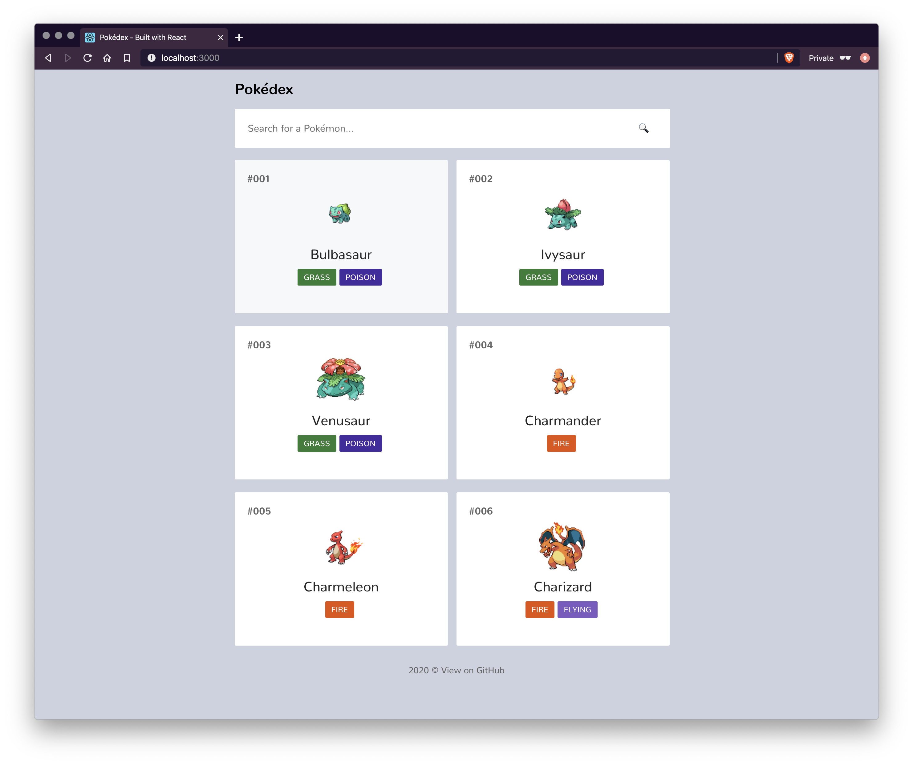

# React Pokédex

A Pokédex built with React.

The goal of this project is to build on my knowledge of React and focus on progressive web applications, performance, accessibility, and SEO.

This is an extension on my previous [Vue Pokédex](https://github.com/shadforth/vue-pokedex), where the goal was to understand and use a JavaScript framework.



## Technology

- React
- Custom hooks
- List virtualisation with `react-window`
- Features of progressive web applications
- TypeScript
- Webpack
- Docker

## Getting started

### Prerequisites

If running the program with Docker, you will need to install:

- [Docker](https://www.docker.com)

If running the program on your local machine, you will need to install:

- [Node.js](https://nodejs.org) (v12 LTS)

### Running the program with Docker

Run the command below to get up and running with Docker containers.

```bash
# Start the container on localhost:3000
./scripts/run
```

### Running the program locally

Run the commands below to get up and running on your local machine.

```bash
# Install all project dependencies
npm install

# Start the application on localhost:3000
npm run start
```
